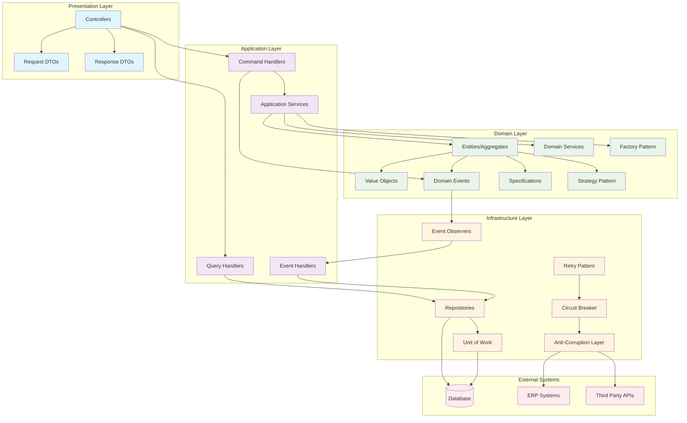
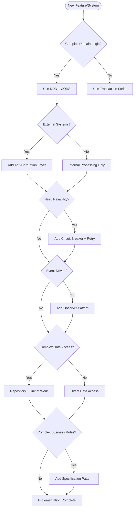

# Pattern Integration and Compatibility Guide

- RBAC CASL: Comprehensive implementation in
  apps/api/src/authorization/abilities.factory.ts with detailed permissions for
  roles (ADMIN, OPERATOR, VIEWER, MANAGER, REGULATOR, AUDITOR) and
  actions/subjects.
- SOLID Principles:
- SRP: Services like AfeApprovalWorkflowService have single responsibilities
- OCP: Strategy patterns for tax calculations and state-specific logic
- LSP: Well state classes properly extend base behavior
- ISP: Segregated interfaces in repositories and services
- DIP: Dependency injection with interfaces in repositories and services
- Hexagonal Architecture: Clear separation with domain core, infrastructure
  adapters (database, external APIs, monitoring), and controllers as driving
  adapters.
- DDD: Domain entities, events, value objects, and domain services in
  apps/api/src/domain/.
- CQRS: Separate read/write models implied through repository interfaces and
  query services.
- Repository Pattern: Repository interfaces and implementations in
  apps/api/src/infrastructure/repositories/ and
  apps/api/src/domain/repositories/.
- DTO Pattern: Data transfer objects used in controllers and services.
- Specification Pattern: Query specifications in repository implementations.
- Unit of Work: unit-of-work.ts and regulatory-unit-of-work.ts for transaction
  management.
- Strategy Pattern: Tenant isolation strategies and other behavioral patterns.
- Factory Pattern: Factories in apps/api/src/domain/factories/ for creating
  domain objects.

## Pattern Compatibility Matrix

### Highly Compatible Patterns (Work Best Together)

- **DDD + CQRS + Repository + Unit of Work**: The golden quartet for complex
  domains
- **Hexagonal + DDD + Anti-Corruption Layer**: Perfect for external system
  integration
- **Strategy + Factory + Observer**: Dynamic behavior with event-driven updates
- **Specification + Repository + DTO**: Clean data access with business rules
- **Circuit Breaker + Retry + Observer**: Resilient system architecture

### Patterns That Can Conflict

- **Active Record vs Repository Pattern**: Choose one approach for data access
- **Transaction Script vs DDD**: Different complexity approaches - don't mix
- **God Object vs Single Responsibility**: Architectural opposites

## Architectural Pattern Integration Diagram



## Pattern Layering Strategy

### Core Foundation (Implement First)

1. **Hexagonal Architecture**: Establishes clean boundaries
2. **DDD**: Rich domain models with business logic
3. **Repository Pattern**: Clean data access abstraction
4. **DTO Pattern**: Data transfer boundaries

### Application Logic (Implement Second)

1. **CQRS**: Separate read/write operations
2. **Unit of Work**: Transaction management
3. **Specification Pattern**: Reusable business rules
4. **Strategy Pattern**: Configurable algorithms

### Resilience & Integration (Implement Third)

1. **Anti-Corruption Layer**: External system integration
2. **Circuit Breaker**: Fault tolerance
3. **Retry Pattern**: Transient failure handling
4. **Observer Pattern**: Event-driven architecture

### Supporting Patterns (Implement As Needed)

1. **Factory Pattern**: Complex object creation
2. **SOLID Principles**: Code quality foundation
3. **RBAC/CASL**: Security and permissions

## Pattern Selection Decision Tree



## Best Practices for Pattern Integration

### 1. Start Small, Build Up

```typescript
// Phase 1: Basic structure
interface UserRepository {
  save(user: User): Promise<void>;
  findById(id: string): Promise<User>;
}

// Phase 2: Add specifications
interface UserRepository {
  save(user: User): Promise<void>;
  findById(id: string): Promise<User>;
  findBySpecification(spec: Specification<User>): Promise<User[]>; // Added
}

// Phase 3: Add unit of work
interface UserRepository {
  save(user: User): Promise<void>;
  findById(id: string): Promise<User>;
  findBySpecification(spec: Specification<User>): Promise<User[]>;
  saveWithinTransaction(user: User, uow: UnitOfWork): Promise<void>; // Added
}
```

### 2. Pattern Boundaries

```typescript
// ✅ Good: Clear pattern boundaries
class LeaseController {
  constructor(
    private readonly commandBus: CommandBus, // CQRS
    private readonly queryBus: QueryBus, // CQRS
  ) {}
}

class CreateLeaseHandler {
  constructor(
    private readonly leaseRepository: LeaseRepository, // Repository
    private readonly unitOfWork: UnitOfWork, // Unit of Work
  ) {}
}

// ❌ Bad: Mixed concerns
class LeaseService {
  constructor(
    private readonly db: Database, // Direct DB access
    private readonly leaseRepository: Repository, // Repository pattern
    private readonly eventBus: EventBus, // Observer pattern
  ) {} // Too many patterns mixed together
}
```

### 3. Pattern Evolution Path

```typescript
// Evolution 1: Simple service
class PaymentService {
  calculateAmount(lease: Lease): number {
    return lease.monthlyRate * lease.acreage;
  }
}

// Evolution 2: Add strategy pattern
class PaymentService {
  constructor(private strategy: PaymentCalculationStrategy) {}

  calculateAmount(lease: Lease): number {
    return this.strategy.calculate(lease);
  }
}

// Evolution 3: Add factory for strategies
class PaymentService {
  constructor(private strategyFactory: PaymentStrategyFactory) {}

  calculateAmount(lease: Lease): number {
    const strategy = this.strategyFactory.create(lease.type);
    return strategy.calculate(lease);
  }
}

// Evolution 4: Add observer for events
class PaymentService {
  constructor(
    private strategyFactory: PaymentStrategyFactory,
    private eventPublisher: EventPublisher,
  ) {}

  calculateAmount(lease: Lease): number {
    const strategy = this.strategyFactory.create(lease.type);
    const amount = strategy.calculate(lease);

    this.eventPublisher.publish(new PaymentCalculatedEvent(lease.id, amount));
    return amount;
  }
}
```

## Anti-Patterns to Avoid

### 1. Pattern Overuse

```typescript
// ❌ Over-engineered for simple CRUD
class GetUserByIdQueryHandlerFactoryBuilderStrategy {
  create(): GetUserByIdQueryHandler {
    return new GetUserByIdQueryHandler();
  }
}

// ✅ Simple and appropriate
class GetUserByIdHandler {
  constructor(private userRepository: UserRepository) {}

  async handle(query: GetUserByIdQuery): Promise<User> {
    return this.userRepository.findById(query.userId);
  }
}
```

### 2. Inconsistent Pattern Application

```typescript
// ❌ Mixing patterns inconsistently
class LeaseService {
  // Repository pattern here
  async createLease(data: CreateLeaseData): Promise<Lease> {
    const lease = new Lease(data);
    return this.leaseRepository.save(lease);
  }

  // Direct database access here - inconsistent!
  async updateLease(id: string, data: UpdateLeaseData): Promise<void> {
    await this.db.query('UPDATE leases SET ... WHERE id = ?', [id]);
  }
}
```

## Pattern Measurement and Success Metrics

### Code Quality Metrics

- **Cyclomatic Complexity**: < 10 per method
- **Coupling**: Low between layers
- **Cohesion**: High within modules
- **Test Coverage**: > 80%

### Architecture Metrics

- **Dependency Direction**: Always inward toward domain
- **Layer Violations**: Zero cross-layer dependencies
- **Pattern Consistency**: Same patterns used consistently

### Business Metrics

- **Feature Delivery Speed**: Patterns should accelerate, not slow down
- **Bug Rate**: Should decrease with better patterns
- **Maintenance Effort**: Should decrease over time

## Recommended Reading Order

1. **SOLID Principles** - Foundation
2. **Hexagonal Architecture** - Structure
3. **Domain-Driven Design** - Business logic
4. **Repository Pattern** - Data access
5. **CQRS Pattern** - Command/Query separation
6. **Unit of Work** - Transaction management
7. **DTO Pattern** - Data transfer
8. **Specification Pattern** - Business rules
9. **Strategy Pattern** - Algorithm variation
10. **Factory Pattern** - Object creation
11. **Observer Pattern** - Event handling
12. **Anti-Corruption Layer** - External integration
13. **Circuit Breaker** - Fault tolerance
14. **Retry Pattern** - Resilience
15. **RBAC/CASL** - Security

This guide provides the roadmap for implementing patterns in a cohesive,
maintainable way that grows with your application's complexity.
