# Frontend Patterns Integration Architecture

## Overview

This document provides a comprehensive view of how all 16 frontend patterns work
together to create a cohesive, enterprise-grade architecture for the WellFlow
oil & gas application. The patterns are organized into layers and interact
through well-defined interfaces to provide maximum flexibility, maintainability,
and scalability.

## Pattern Categories & Layers

### **Layer 1: Foundation Patterns (Data & State)**

- **Repository Pattern** - Centralized data access
- **Soft Delete Pattern** - Universal data lifecycle management
- **State Management Pattern** - Global and local state coordination
- **Memento Pattern** - State history and undo/redo functionality

### **Layer 2: Business Logic Patterns**

- **Command/Query Separation (CQRS)** - Clean operation separation
- **Specification Pattern** - Reusable business rules
- **Chain of Responsibility** - Flexible validation and processing
- **Strategy Pattern** - Dynamic behavior selection

### **Layer 3: Integration Patterns**

- **Adapter Pattern** - External system integration
- **Proxy Pattern** - Intelligent caching and offline support
- **Event-Driven Architecture** - Component decoupling

### **Layer 4: UI Construction Patterns**

- **Component Factory Pattern** - Dynamic UI generation
- **Builder Pattern** - Complex form construction
- **Template Method Pattern** - Standardized workflows
- **Decorator Pattern** - Cross-cutting UI concerns

### **Layer 5: Data Processing Patterns**

- **Visitor Pattern** - Complex data operations

## Architecture Overview

```mermaid
graph TB
    subgraph "Layer 5: Data Processing"
        VP[Visitor Pattern]
    end

    subgraph "Layer 4: UI Construction"
        CF[Component Factory]
        BP[Builder Pattern]
        TMP[Template Method]
        DP[Decorator Pattern]
    end

    subgraph "Layer 3: Integration"
        AP[Adapter Pattern]
        PP[Proxy Pattern]
        EDA[Event-Driven Architecture]
    end

    subgraph "Layer 2: Business Logic"
        CQRS[Command/Query Separation]
        SP[Specification Pattern]
        CR[Chain of Responsibility]
        STP[Strategy Pattern]
    end

    subgraph "Layer 1: Foundation"
        RP[Repository Pattern]
        SD[Soft Delete Pattern]
        SMP[State Management]
        MP[Memento Pattern]
    end

    subgraph "External Systems"
        API[REST APIs]
        DB[(Database)]
        REG[Regulatory APIs]
        MAP[Mapping Services]
    end

    subgraph "React Components"
        COMP[UI Components]
        FORMS[Forms]
        TABLES[Tables]
        REPORTS[Reports]
    end

    %% Layer connections
    VP --> CF
    VP --> BP
    VP --> TMP

    CF --> CQRS
    BP --> CQRS
    TMP --> CQRS
    DP --> COMP
    DP --> FORMS

    AP --> API
    AP --> REG
    AP --> MAP
    PP --> RP
    EDA --> SMP

    CQRS --> RP
    SP --> CR
    CR --> RP
    STP --> COMP

    RP --> SD
    RP --> PP
    SMP --> MP

    %% External connections
    RP --> DB
    AP --> External Systems

    %% UI connections
    COMP --> Layer 4
    FORMS --> Layer 4
    TABLES --> Layer 4
    REPORTS --> Layer 4

    classDef foundation fill:#e1f5fe
    classDef business fill:#f3e5f5
    classDef integration fill:#e8f5e8
    classDef ui fill:#fff3e0
    classDef processing fill:#fce4ec

    class RP,SD,SMP,MP foundation
    class CQRS,SP,CR,STP business
    class AP,PP,EDA integration
    class CF,BP,TMP,DP ui
    class VP processing
```

## Pattern Interaction Flow

### **Data Flow Architecture**

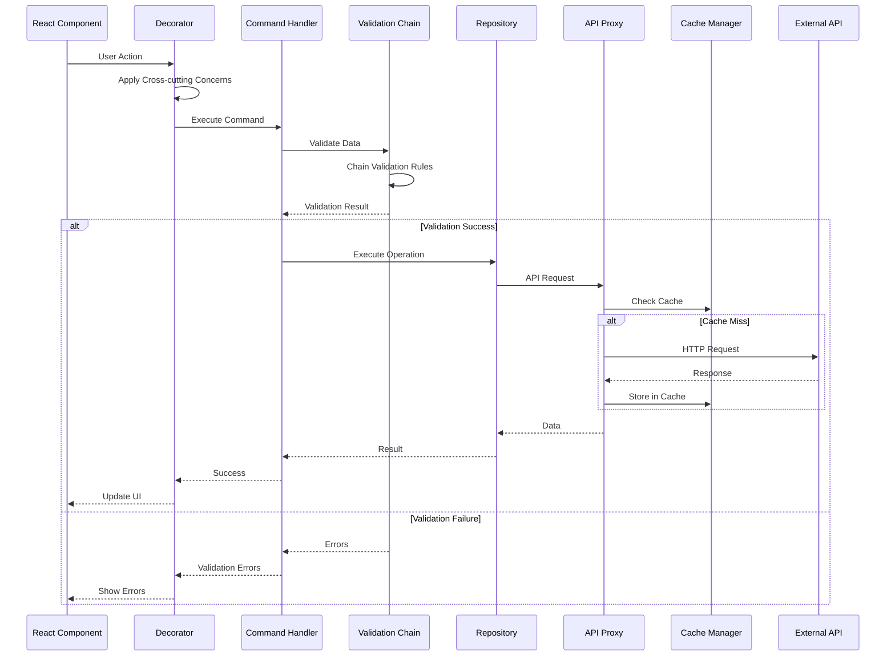
```mermaid
sequenceDiagram
    participant UI as React Component
    participant Dec as Decorator
    participant Cmd as Command Handler
    participant Val as Validation Chain
    participant Repo as Repository
    participant Proxy as API Proxy
    participant Cache as Cache Manager
    participant API as External API

    UI->>Dec: User Action
    Dec->>Dec: Apply Cross-cutting Concerns
    Dec->>Cmd: Execute Command
    Cmd->>Val: Validate Data
    Val->>Val: Chain Validation Rules
    Val-->>Cmd: Validation Result

    alt Validation Success
        Cmd->>Repo: Execute Operation
        Repo->>Proxy: API Request
        Proxy->>Cache: Check Cache

        alt Cache Miss
            Proxy->>API: HTTP Request
            API-->>Proxy: Response
            Proxy->>Cache: Store in Cache
        end

        Proxy-->>Repo: Data
        Repo-->>Cmd: Result
        Cmd-->>Dec: Success
        Dec-->>UI: Update UI
    else Validation Failure
        Val-->>Cmd: Errors
        Cmd-->>Dec: Validation Errors
        Dec-->>UI: Show Errors
    end
```

### **Form Processing Workflow**

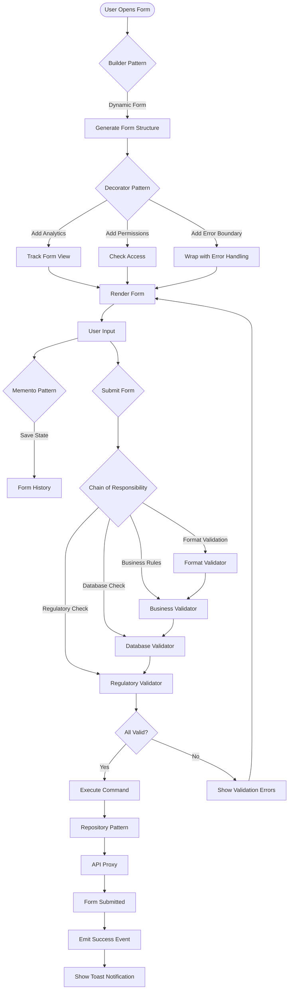
```mermaid
flowchart TD
    Start([User Opens Form]) --> Builder{Builder Pattern}
    Builder --> |Dynamic Form| FormGen[Generate Form Structure]
    FormGen --> Decorator{Decorator Pattern}
    Decorator --> |Add Analytics| Analytics[Track Form View]
    Decorator --> |Add Permissions| Permissions[Check Access]
    Decorator --> |Add Error Boundary| ErrorBoundary[Wrap with Error Handling]

    Analytics --> FormRender[Render Form]
    Permissions --> FormRender
    ErrorBoundary --> FormRender

    FormRender --> UserInput[User Input]
    UserInput --> Memento{Memento Pattern}
    Memento --> |Save State| StateHistory[Form History]

    UserInput --> Submit{Submit Form}
    Submit --> Chain{Chain of Responsibility}
    Chain --> |Format Validation| FormatVal[Format Validator]
    Chain --> |Business Rules| BusinessVal[Business Validator]
    Chain --> |Database Check| DatabaseVal[Database Validator]
    Chain --> |Regulatory Check| RegulatoryVal[Regulatory Validator]

    FormatVal --> BusinessVal
    BusinessVal --> DatabaseVal
    DatabaseVal --> RegulatoryVal

    RegulatoryVal --> Valid{All Valid?}
    Valid --> |Yes| Command[Execute Command]
    Valid --> |No| ShowErrors[Show Validation Errors]

    Command --> Repository[Repository Pattern]
    Repository --> Proxy[API Proxy]
    Proxy --> Success[Form Submitted]

    ShowErrors --> FormRender
    Success --> Event[Emit Success Event]
    Event --> Notification[Show Toast Notification]
```

## Pattern Integration Examples

### **Well Management Integration**

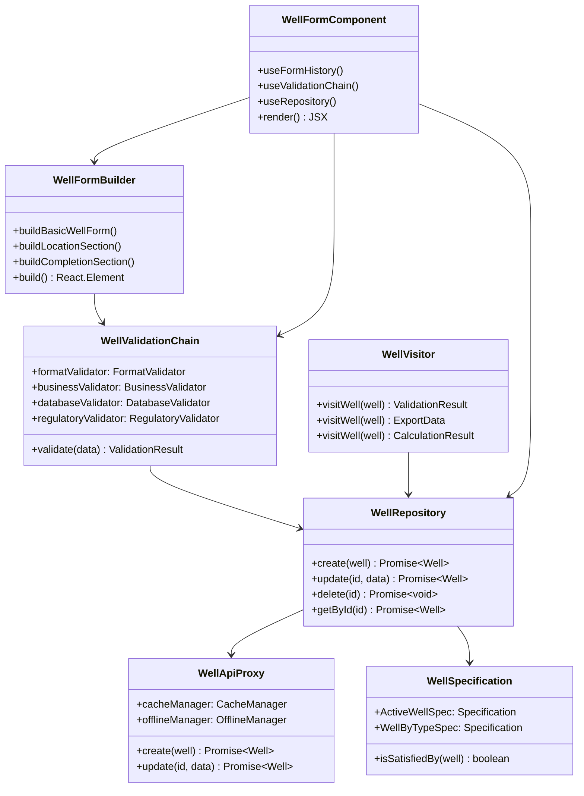
```mermaid
classDiagram
    class WellFormBuilder {
        +buildBasicWellForm()
        +buildLocationSection()
        +buildCompletionSection()
        +build() React.Element
    }

    class WellValidationChain {
        +formatValidator: FormatValidator
        +businessValidator: BusinessValidator
        +databaseValidator: DatabaseValidator
        +regulatoryValidator: RegulatoryValidator
        +validate(data) ValidationResult
    }

    class WellRepository {
        +create(well) Promise~Well~
        +update(id, data) Promise~Well~
        +delete(id) Promise~void~
        +getById(id) Promise~Well~
    }

    class WellApiProxy {
        +cacheManager: CacheManager
        +offlineManager: OfflineManager
        +create(well) Promise~Well~
        +update(id, data) Promise~Well~
    }

    class WellSpecification {
        +ActiveWellSpec: Specification
        +WellByTypeSpec: Specification
        +isSatisfiedBy(well) boolean
    }

    class WellVisitor {
        +visitWell(well) ValidationResult
        +visitWell(well) ExportData
        +visitWell(well) CalculationResult
    }

    WellFormBuilder --> WellValidationChain
    WellValidationChain --> WellRepository
    WellRepository --> WellApiProxy
    WellRepository --> WellSpecification
    WellVisitor --> WellRepository

    class WellFormComponent {
        +useFormHistory()
        +useValidationChain()
        +useRepository()
        +render() JSX
    }

    WellFormComponent --> WellFormBuilder
    WellFormComponent --> WellValidationChain
    WellFormComponent --> WellRepository
```

### **Report Generation Integration**

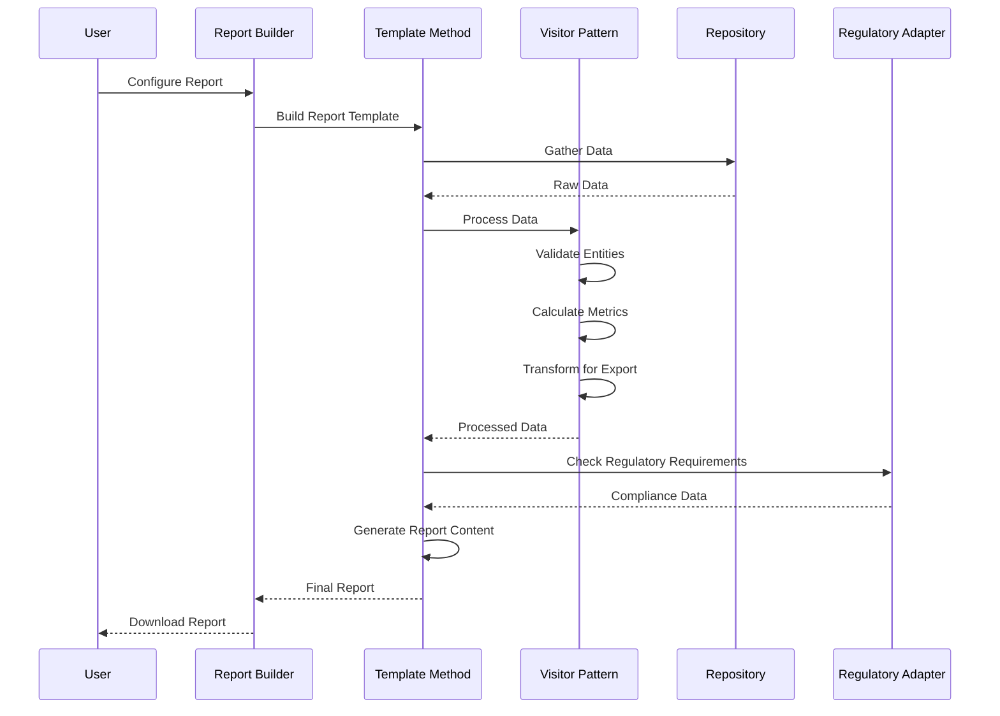
```mermaid
sequenceDiagram
    participant User
    participant ReportBuilder as Report Builder
    participant Template as Template Method
    participant Visitor as Visitor Pattern
    participant Repository as Repository
    participant Adapter as Regulatory Adapter

    User->>ReportBuilder: Configure Report
    ReportBuilder->>Template: Build Report Template
    Template->>Repository: Gather Data
    Repository-->>Template: Raw Data

    Template->>Visitor: Process Data
    Visitor->>Visitor: Validate Entities
    Visitor->>Visitor: Calculate Metrics
    Visitor->>Visitor: Transform for Export
    Visitor-->>Template: Processed Data

    Template->>Adapter: Check Regulatory Requirements
    Adapter-->>Template: Compliance Data

    Template->>Template: Generate Report Content
    Template-->>ReportBuilder: Final Report
    ReportBuilder-->>User: Download Report
```

## State Management Integration

### **Global State Architecture**

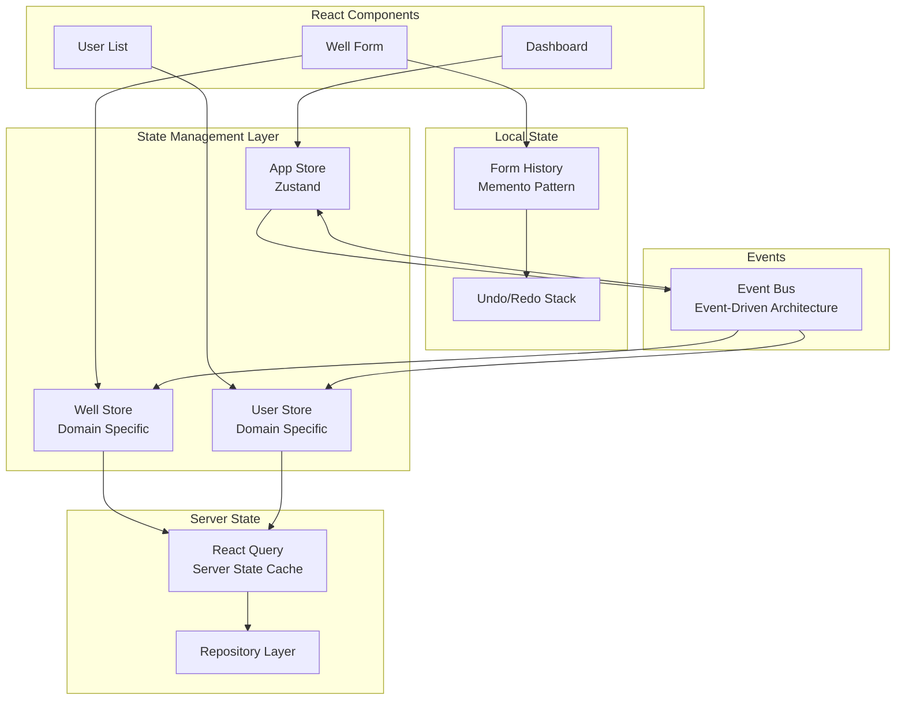
```mermaid
graph TB
    subgraph "React Components"
        WellForm[Well Form]
        UserList[User List]
        Dashboard[Dashboard]
    end

    subgraph "State Management Layer"
        AppStore[App Store<br/>Zustand]
        WellStore[Well Store<br/>Domain Specific]
        UserStore[User Store<br/>Domain Specific]
    end

    subgraph "Server State"
        ReactQuery[React Query<br/>Server State Cache]
        Repository[Repository Layer]
    end

    subgraph "Local State"
        FormHistory[Form History<br/>Memento Pattern]
        UndoRedo[Undo/Redo Stack]
    end

    subgraph "Events"
        EventBus[Event Bus<br/>Event-Driven Architecture]
    end

    WellForm --> WellStore
    WellForm --> FormHistory
    UserList --> UserStore
    Dashboard --> AppStore

    WellStore --> ReactQuery
    UserStore --> ReactQuery
    AppStore --> EventBus

    ReactQuery --> Repository
    FormHistory --> UndoRedo

    EventBus --> WellStore
    EventBus --> UserStore
    EventBus --> AppStore
```

### **Event Flow Integration**

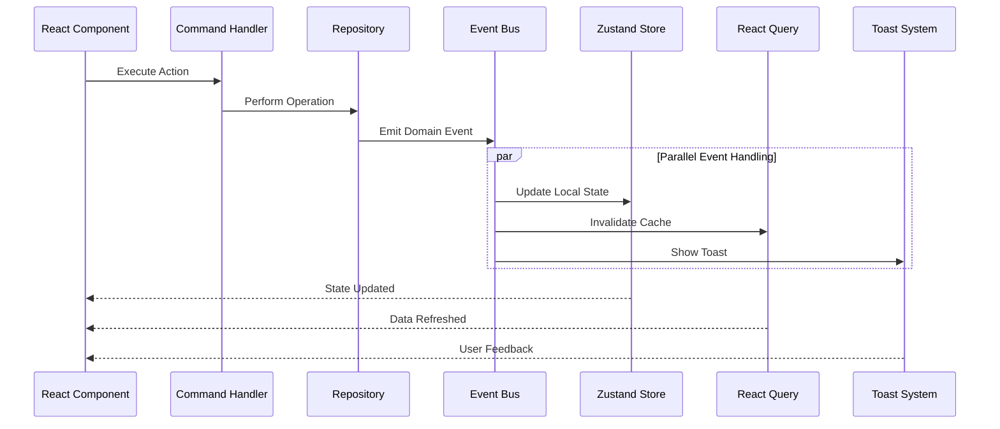
```mermaid
sequenceDiagram
    participant Component as React Component
    participant Command as Command Handler
    participant Repository as Repository
    participant EventBus as Event Bus
    participant Store as Zustand Store
    participant Cache as React Query
    participant Notification as Toast System

    Component->>Command: Execute Action
    Command->>Repository: Perform Operation
    Repository->>EventBus: Emit Domain Event

    par Parallel Event Handling
        EventBus->>Store: Update Local State
        EventBus->>Cache: Invalidate Cache
        EventBus->>Notification: Show Toast
    end

    Store-->>Component: State Updated
    Cache-->>Component: Data Refreshed
    Notification-->>Component: User Feedback
```

## Offline-First Architecture

### **Offline Support Integration**

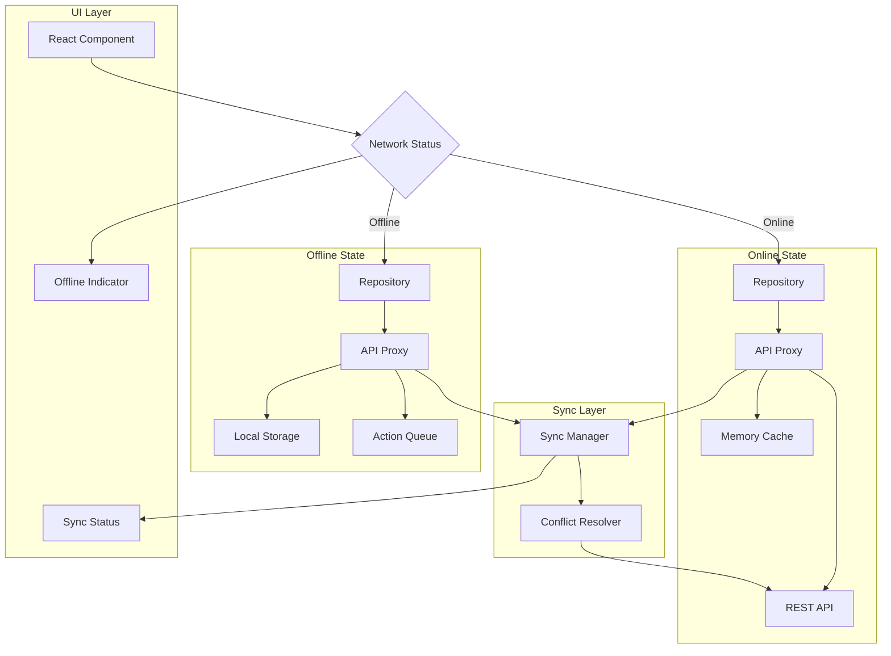
```mermaid
flowchart TD
    subgraph "Online State"
        OnlineRepo[Repository] --> OnlineProxy[API Proxy]
        OnlineProxy --> OnlineAPI[REST API]
        OnlineProxy --> OnlineCache[Memory Cache]
    end

    subgraph "Offline State"
        OfflineRepo[Repository] --> OfflineProxy[API Proxy]
        OfflineProxy --> OfflineStorage[Local Storage]
        OfflineProxy --> OfflineQueue[Action Queue]
    end

    subgraph "Sync Layer"
        SyncManager[Sync Manager]
        ConflictResolver[Conflict Resolver]
    end

    NetworkDetector{Network Status} --> |Online| OnlineRepo
    NetworkDetector --> |Offline| OfflineRepo

    OnlineProxy --> SyncManager
    OfflineProxy --> SyncManager

    SyncManager --> ConflictResolver
    ConflictResolver --> OnlineAPI

    subgraph "UI Layer"
        Component[React Component]
        OfflineIndicator[Offline Indicator]
        SyncStatus[Sync Status]
    end

    Component --> NetworkDetector
    NetworkDetector --> OfflineIndicator
    SyncManager --> SyncStatus
```

## Performance Optimization Integration

### **Caching Strategy**

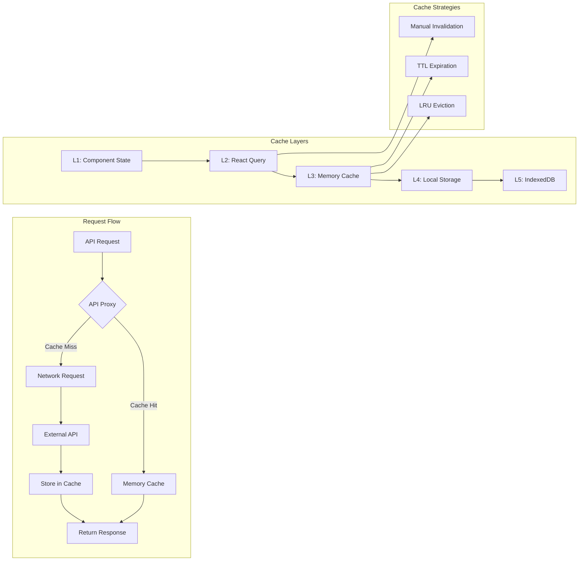
```mermaid
graph LR
    subgraph "Request Flow"
        Request[API Request] --> Proxy{API Proxy}
        Proxy --> |Cache Hit| MemCache[Memory Cache]
        Proxy --> |Cache Miss| Network[Network Request]
        Network --> API[External API]
        API --> Store[Store in Cache]
        Store --> Response[Return Response]
        MemCache --> Response
    end

    subgraph "Cache Layers"
        L1[L1: Component State]
        L2[L2: React Query]
        L3[L3: Memory Cache]
        L4[L4: Local Storage]
        L5[L5: IndexedDB]
    end

    subgraph "Cache Strategies"
        LRU[LRU Eviction]
        TTL[TTL Expiration]
        Manual[Manual Invalidation]
    end

    L1 --> L2
    L2 --> L3
    L3 --> L4
    L4 --> L5

    L3 --> LRU
    L3 --> TTL
    L2 --> Manual
```

## Error Handling Integration

### **Error Propagation Flow**

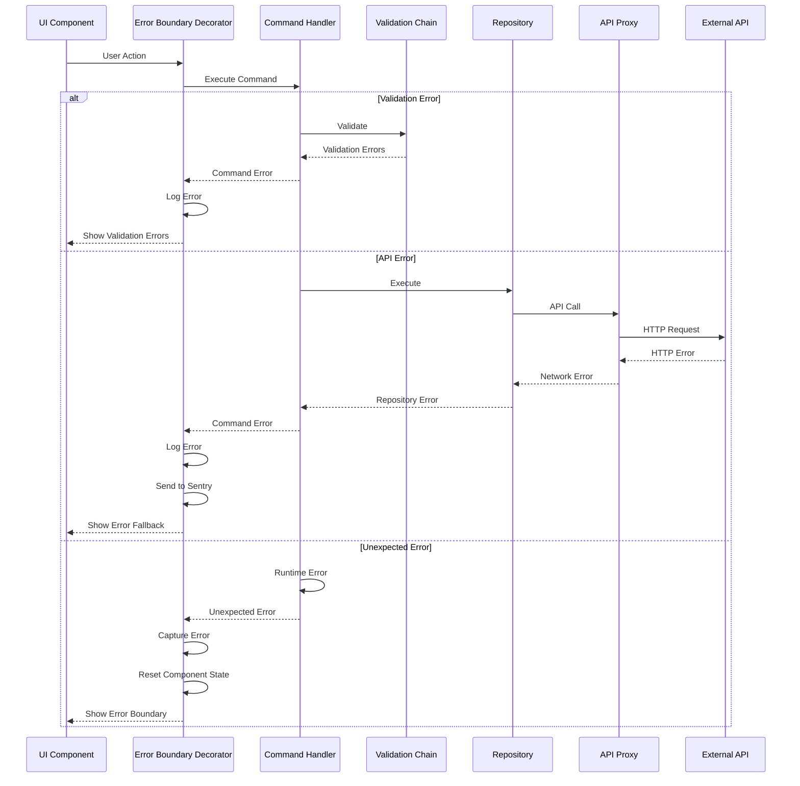
```mermaid
sequenceDiagram
    participant UI as UI Component
    participant Decorator as Error Boundary Decorator
    participant Command as Command Handler
    participant Chain as Validation Chain
    participant Repository as Repository
    participant Proxy as API Proxy
    participant API as External API

    UI->>Decorator: User Action
    Decorator->>Command: Execute Command

    alt Validation Error
        Command->>Chain: Validate
        Chain-->>Command: Validation Errors
        Command-->>Decorator: Command Error
        Decorator->>Decorator: Log Error
        Decorator-->>UI: Show Validation Errors
    else API Error
        Command->>Repository: Execute
        Repository->>Proxy: API Call
        Proxy->>API: HTTP Request
        API-->>Proxy: HTTP Error
        Proxy-->>Repository: Network Error
        Repository-->>Command: Repository Error
        Command-->>Decorator: Command Error
        Decorator->>Decorator: Log Error
        Decorator->>Decorator: Send to Sentry
        Decorator-->>UI: Show Error Fallback
    else Unexpected Error
        Command->>Command: Runtime Error
        Command-->>Decorator: Unexpected Error
        Decorator->>Decorator: Capture Error
        Decorator->>Decorator: Reset Component State
        Decorator-->>UI: Show Error Boundary
    end
```

## Testing Integration Strategy

### **Testing Pyramid with Patterns**

```mermaid
pyramid
    title Testing Strategy

    section "E2E Tests"
        desc "Full user workflows with all patterns integrated"
        items "Playwright tests for complete user journeys"

    section "Integration Tests"
        desc "Pattern interactions and data flow"
        items "Repository + Proxy + Cache integration"
        items "Form Builder + Validation Chain + Command"
        items "Event Bus + State Management + UI updates"

    section "Unit Tests"
        desc "Individual pattern implementations"
        items "Repository pattern methods"
        items "Validation chain handlers"
        items "Builder pattern construction"
        items "Visitor pattern operations"
        items "Decorator pattern enhancements"
```

## Deployment Architecture

### **Production Deployment Integration**

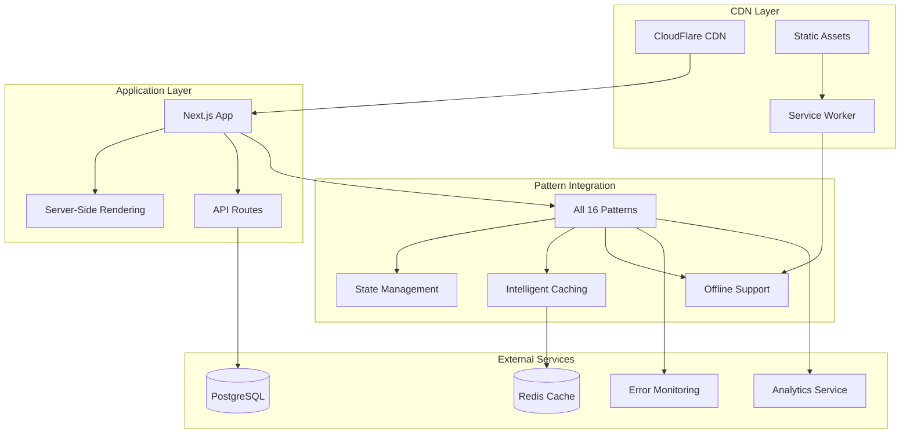
```mermaid
graph TB
    subgraph "CDN Layer"
        CDN[CloudFlare CDN]
        StaticAssets[Static Assets]
        ServiceWorker[Service Worker]
    end

    subgraph "Application Layer"
        NextJS[Next.js App]
        SSR[Server-Side Rendering]
        API[API Routes]
    end

    subgraph "Pattern Integration"
        Patterns[All 16 Patterns]
        StateManagement[State Management]
        Caching[Intelligent Caching]
        OfflineSupport[Offline Support]
    end

    subgraph "External Services"
        Database[(PostgreSQL)]
        Redis[(Redis Cache)]
        Sentry[Error Monitoring]
        Analytics[Analytics Service]
    end

    CDN --> NextJS
    StaticAssets --> ServiceWorker
    ServiceWorker --> OfflineSupport

    NextJS --> SSR
    NextJS --> API
    NextJS --> Patterns

    Patterns --> StateManagement
    Patterns --> Caching
    Patterns --> OfflineSupport

    API --> Database
    Caching --> Redis
    Patterns --> Sentry
    Patterns --> Analytics
```

## Detailed Pattern Interactions

### **Repository + Proxy + Cache Integration**

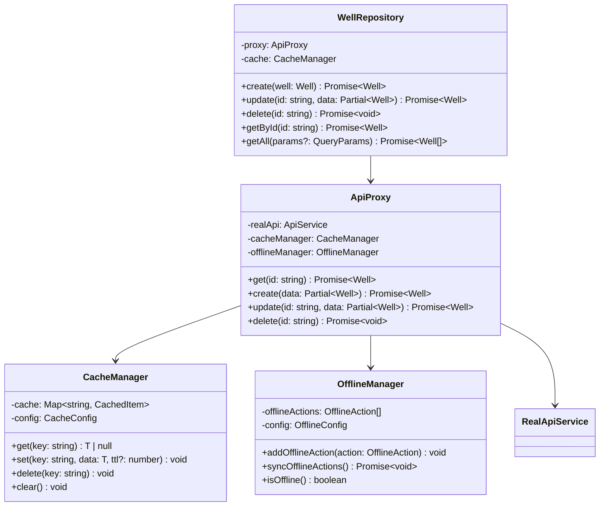
```mermaid
classDiagram
    class WellRepository {
        -proxy: ApiProxy
        -cache: CacheManager
        +create(well: Well) Promise~Well~
        +update(id: string, data: Partial~Well~) Promise~Well~
        +delete(id: string) Promise~void~
        +getById(id: string) Promise~Well~
        +getAll(params?: QueryParams) Promise~Well[]~
    }

    class ApiProxy {
        -realApi: ApiService
        -cacheManager: CacheManager
        -offlineManager: OfflineManager
        +get(id: string) Promise~Well~
        +create(data: Partial~Well~) Promise~Well~
        +update(id: string, data: Partial~Well~) Promise~Well~
        +delete(id: string) Promise~void~
    }

    class CacheManager {
        -cache: Map~string, CachedItem~
        -config: CacheConfig
        +get(key: string) T | null
        +set(key: string, data: T, ttl?: number) void
        +delete(key: string) void
        +clear() void
    }

    class OfflineManager {
        -offlineActions: OfflineAction[]
        -config: OfflineConfig
        +addOfflineAction(action: OfflineAction) void
        +syncOfflineActions() Promise~void~
        +isOffline() boolean
    }

    WellRepository --> ApiProxy
    ApiProxy --> CacheManager
    ApiProxy --> OfflineManager
    ApiProxy --> RealApiService
```

### **Form Builder + Validation + Command Integration**

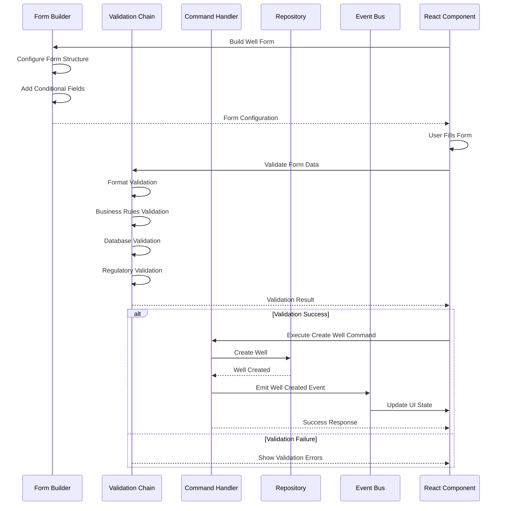
```mermaid
sequenceDiagram
    participant FB as Form Builder
    participant VC as Validation Chain
    participant CH as Command Handler
    participant R as Repository
    participant EB as Event Bus
    participant UI as React Component

    UI->>FB: Build Well Form
    FB->>FB: Configure Form Structure
    FB->>FB: Add Conditional Fields
    FB-->>UI: Form Configuration

    UI->>UI: User Fills Form
    UI->>VC: Validate Form Data

    VC->>VC: Format Validation
    VC->>VC: Business Rules Validation
    VC->>VC: Database Validation
    VC->>VC: Regulatory Validation
    VC-->>UI: Validation Result

    alt Validation Success
        UI->>CH: Execute Create Well Command
        CH->>R: Create Well
        R-->>CH: Well Created
        CH->>EB: Emit Well Created Event
        EB->>UI: Update UI State
        CH-->>UI: Success Response
    else Validation Failure
        VC-->>UI: Show Validation Errors
    end
```

### **Event-Driven State Management Integration**

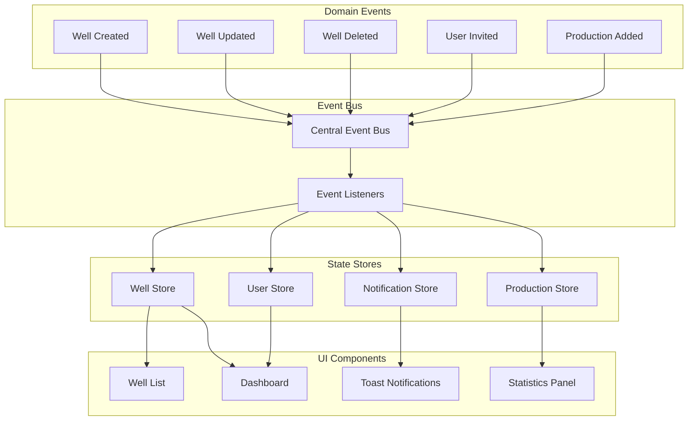
```mermaid
graph TD
    subgraph "Domain Events"
        WellCreated[Well Created]
        WellUpdated[Well Updated]
        WellDeleted[Well Deleted]
        UserInvited[User Invited]
        ProductionAdded[Production Added]
    end

    subgraph "Event Bus"
        EventBus[Central Event Bus]
        EventListeners[Event Listeners]
    end

    subgraph "State Stores"
        WellStore[Well Store]
        UserStore[User Store]
        ProductionStore[Production Store]
        NotificationStore[Notification Store]
    end

    subgraph "UI Components"
        WellList[Well List]
        Dashboard[Dashboard]
        Notifications[Toast Notifications]
        Statistics[Statistics Panel]
    end

    WellCreated --> EventBus
    WellUpdated --> EventBus
    WellDeleted --> EventBus
    UserInvited --> EventBus
    ProductionAdded --> EventBus

    EventBus --> EventListeners
    EventListeners --> WellStore
    EventListeners --> UserStore
    EventListeners --> ProductionStore
    EventListeners --> NotificationStore

    WellStore --> WellList
    WellStore --> Dashboard
    UserStore --> Dashboard
    ProductionStore --> Statistics
    NotificationStore --> Notifications
```

### **Decorator Pattern Cross-Cutting Concerns**

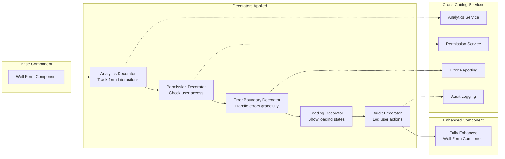
```mermaid
flowchart LR
    subgraph "Base Component"
        BaseComp[Well Form Component]
    end

    subgraph "Decorators Applied"
        Analytics[Analytics Decorator<br/>Track form interactions]
        Permissions[Permission Decorator<br/>Check user access]
        ErrorBoundary[Error Boundary Decorator<br/>Handle errors gracefully]
        Loading[Loading Decorator<br/>Show loading states]
        Audit[Audit Decorator<br/>Log user actions]
    end

    subgraph "Enhanced Component"
        EnhancedComp[Fully Enhanced<br/>Well Form Component]
    end

    BaseComp --> Analytics
    Analytics --> Permissions
    Permissions --> ErrorBoundary
    ErrorBoundary --> Loading
    Loading --> Audit
    Audit --> EnhancedComp

    subgraph "Cross-Cutting Services"
        AnalyticsService[Analytics Service]
        PermissionService[Permission Service]
        ErrorService[Error Reporting]
        AuditService[Audit Logging]
    end

    Analytics -.-> AnalyticsService
    Permissions -.-> PermissionService
    ErrorBoundary -.-> ErrorService
    Audit -.-> AuditService
```

## Real-World Integration Scenarios

### **Scenario 1: Well Completion Form Workflow**

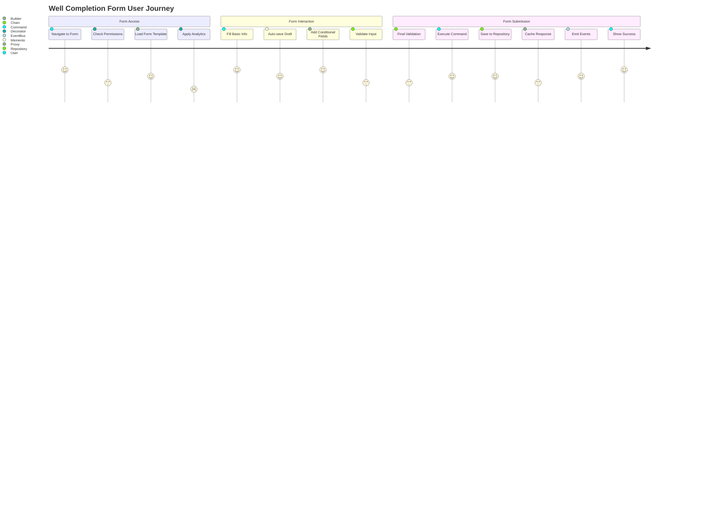
```mermaid
journey
    title Well Completion Form User Journey
    section Form Access
        Navigate to Form: 5: User
        Check Permissions: 3: Decorator
        Load Form Template: 4: Builder
        Apply Analytics: 2: Decorator
    section Form Interaction
        Fill Basic Info: 5: User
        Auto-save Draft: 4: Memento
        Add Conditional Fields: 5: Builder
        Validate Input: 3: Chain
    section Form Submission
        Final Validation: 3: Chain
        Execute Command: 4: Command
        Save to Repository: 4: Repository
        Cache Response: 3: Proxy
        Emit Events: 4: EventBus
        Show Success: 5: User
```

### **Scenario 2: Offline Data Entry and Sync**

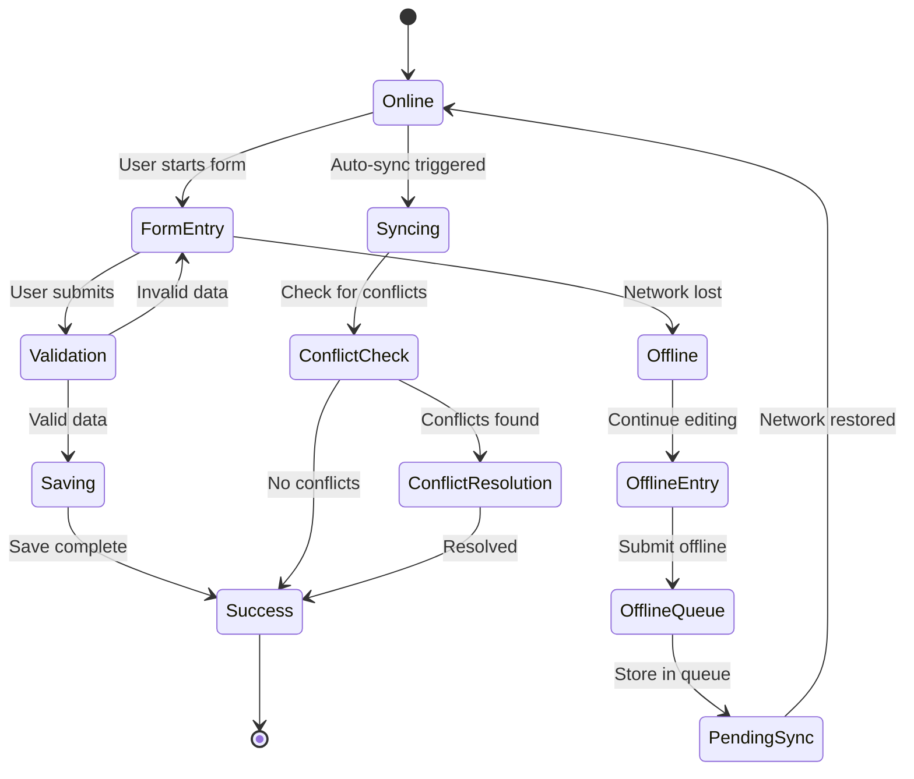
```mermaid
stateDiagram-v2
    [*] --> Online
    Online --> FormEntry: User starts form
    FormEntry --> Validation: User submits
    Validation --> Saving: Valid data
    Saving --> Success: Save complete
    Success --> [*]

    FormEntry --> Offline: Network lost
    Offline --> OfflineEntry: Continue editing
    OfflineEntry --> OfflineQueue: Submit offline
    OfflineQueue --> PendingSync: Store in queue
    PendingSync --> Online: Network restored
    Online --> Syncing: Auto-sync triggered
    Syncing --> ConflictCheck: Check for conflicts
    ConflictCheck --> Success: No conflicts
    ConflictCheck --> ConflictResolution: Conflicts found
    ConflictResolution --> Success: Resolved

    Validation --> FormEntry: Invalid data
```

### **Scenario 3: Report Generation Pipeline**

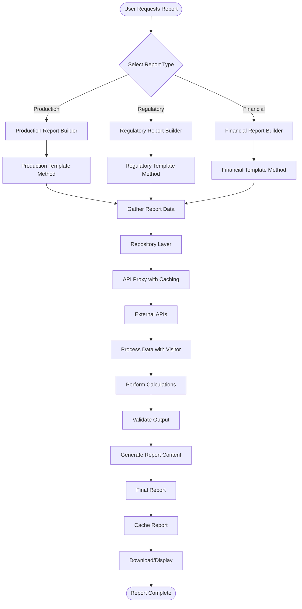
```mermaid
flowchart TD
    Start([User Requests Report]) --> SelectType{Select Report Type}

    SelectType --> |Production| ProdBuilder[Production Report Builder]
    SelectType --> |Regulatory| RegBuilder[Regulatory Report Builder]
    SelectType --> |Financial| FinBuilder[Financial Report Builder]

    ProdBuilder --> ProdTemplate[Production Template Method]
    RegBuilder --> RegTemplate[Regulatory Template Method]
    FinBuilder --> FinTemplate[Financial Template Method]

    ProdTemplate --> GatherData[Gather Report Data]
    RegTemplate --> GatherData
    FinTemplate --> GatherData

    GatherData --> Repository[Repository Layer]
    Repository --> Proxy[API Proxy with Caching]
    Proxy --> ExternalAPIs[External APIs]

    ExternalAPIs --> ProcessData[Process Data with Visitor]
    ProcessData --> Calculations[Perform Calculations]
    Calculations --> Validation[Validate Output]
    Validation --> GenerateContent[Generate Report Content]
    GenerateContent --> FinalReport[Final Report]

    FinalReport --> Cache[Cache Report]
    Cache --> Download[Download/Display]
    Download --> End([Report Complete])
```

## Performance Optimization Patterns

### **Lazy Loading and Code Splitting Integration**

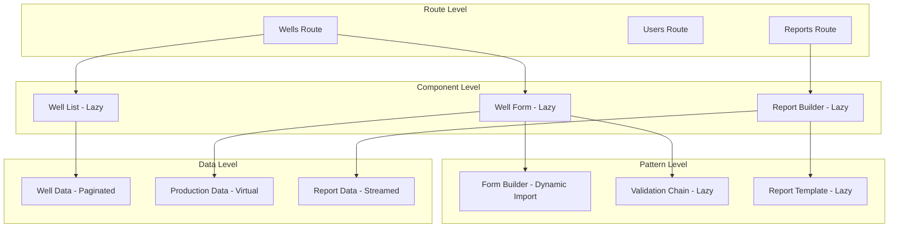
```mermaid
graph TB
    subgraph "Route Level"
        WellsRoute[Wells Route]
        UsersRoute[Users Route]
        ReportsRoute[Reports Route]
    end

    subgraph "Component Level"
        WellForm[Well Form - Lazy]
        WellList[Well List - Lazy]
        ReportBuilder[Report Builder - Lazy]
    end

    subgraph "Pattern Level"
        FormBuilder[Form Builder - Dynamic Import]
        ValidationChain[Validation Chain - Lazy]
        ReportTemplate[Report Template - Lazy]
    end

    subgraph "Data Level"
        WellData[Well Data - Paginated]
        ProductionData[Production Data - Virtual]
        ReportData[Report Data - Streamed]
    end

    WellsRoute --> WellForm
    WellsRoute --> WellList
    ReportsRoute --> ReportBuilder

    WellForm --> FormBuilder
    WellForm --> ValidationChain
    ReportBuilder --> ReportTemplate

    WellList --> WellData
    WellForm --> ProductionData
    ReportBuilder --> ReportData
```

### **Memory Management Integration**

```mermaid
sequenceDiagram
    participant GC as Garbage Collector
    participant CM as Cache Manager
    participant MM as Memento Manager
    participant EM as Event Manager
    participant SM as State Manager

    Note over GC,SM: Memory Pressure Detected

    GC->>CM: Request Cache Cleanup
    CM->>CM: Evict LRU Items
    CM->>CM: Clear Expired Items
    CM-->>GC: Memory Freed

    GC->>MM: Request History Cleanup
    MM->>MM: Trim Old Mementos
    MM->>MM: Compress Large States
    MM-->>GC: Memory Freed

    GC->>EM: Request Event Cleanup
    EM->>EM: Remove Stale Listeners
    EM->>EM: Clear Event History
    EM-->>GC: Memory Freed

    GC->>SM: Request State Cleanup
    SM->>SM: Clear Unused Stores
    SM->>SM: Persist Critical State
    SM-->>GC: Memory Freed
```

## Security Integration

### **Security Layer Integration**

```mermaid
graph LR
    subgraph "Authentication Layer"
        Auth[Authentication Service]
        JWT[JWT Token Management]
        Refresh[Token Refresh]
    end

    subgraph "Authorization Layer"
        RBAC[Role-Based Access Control]
        Permissions[Permission Checking]
        Specifications[Permission Specifications]
    end

    subgraph "Data Security Layer"
        Encryption[Data Encryption]
        Sanitization[Input Sanitization]
        Validation[Security Validation]
    end

    subgraph "Pattern Integration"
        Decorator[Security Decorators]
        Chain[Security Validation Chain]
        Proxy[Secure API Proxy]
        Repository[Secure Repository]
    end

    Auth --> RBAC
    JWT --> Permissions
    Refresh --> Specifications

    RBAC --> Encryption
    Permissions --> Sanitization
    Specifications --> Validation

    Encryption --> Decorator
    Sanitization --> Chain
    Validation --> Proxy
    Proxy --> Repository
```

## Monitoring and Observability

### **Observability Integration**

```mermaid
graph TB
    subgraph "Application Layer"
        Components[React Components]
        Patterns[Design Patterns]
        Services[Business Services]
    end

    subgraph "Instrumentation Layer"
        Metrics[Metrics Collection]
        Tracing[Distributed Tracing]
        Logging[Structured Logging]
        Events[Event Tracking]
    end

    subgraph "Collection Layer"
        Sentry[Error Monitoring]
        Analytics[User Analytics]
        Performance[Performance Monitoring]
        Business[Business Metrics]
    end

    subgraph "Visualization Layer"
        Dashboards[Monitoring Dashboards]
        Alerts[Alert Management]
        Reports[Performance Reports]
    end

    Components --> Metrics
    Patterns --> Tracing
    Services --> Logging
    Components --> Events

    Metrics --> Sentry
    Tracing --> Analytics
    Logging --> Performance
    Events --> Business

    Sentry --> Dashboards
    Analytics --> Alerts
    Performance --> Reports
    Business --> Dashboards
```

This comprehensive integration architecture ensures that all 16 frontend
patterns work together seamlessly to provide an enterprise-grade, maintainable,
and scalable solution for the WellFlow oil & gas application. Each pattern has
its specific role while contributing to the overall system's robustness,
flexibility, and performance.
