# Backend Patterns Integration Architecture

## Overview

This document provides a comprehensive view of how all backend patterns work
together to create a cohesive, enterprise-grade API architecture for the
WellFlow oil & gas application. The patterns are organized into layers and
interact through well-defined interfaces to provide maximum flexibility,
maintainability, and scalability.

## Backend Pattern Categories & Layers

### **Layer 1: Domain Core (Business Logic)**

- **Domain-Driven Design (DDD)** - Rich domain models and business logic
- **SOLID Principles** - Clean code and design principles
- **Specification Pattern** - Reusable business rules and queries
- **Strategy Pattern** - Dynamic behavior selection
- **Factory Pattern** - Domain object creation

### **Layer 2: Application Services (Use Cases)**

- **CQRS Pattern** - Command and Query separation
- **Unit of Work Pattern** - Transaction management
- **Observer Pattern** - Event-driven architecture
- **DTO Pattern** - Data transfer boundaries

### **Layer 3: Infrastructure (Data & External Systems)**

- **Repository Pattern** - Data access abstraction
- **Hexagonal Architecture** - Clean boundaries
- **Anti-Corruption Layer** - External system integration
- **Circuit Breaker Pattern** - Resilience and fault tolerance
- **Retry Pattern** - Failure recovery

### **Layer 4: Security & Authorization**

- **RBAC with CASL** - Role-based access control

## Backend Architecture Overview

```mermaid
graph TB
    subgraph "Layer 4: Security & Authorization"
        RBAC[RBAC with CASL]
        Auth[Authentication]
        Authz[Authorization]
    end

    subgraph "Layer 3: Infrastructure"
        Repo[Repository Pattern]
        Hex[Hexagonal Architecture]
        ACL[Anti-Corruption Layer]
        CB[Circuit Breaker]
        Retry[Retry Pattern]
    end

    subgraph "Layer 2: Application Services"
        CQRS[CQRS Pattern]
        UoW[Unit of Work]
        Observer[Observer Pattern]
        DTO[DTO Pattern]
    end

    subgraph "Layer 1: Domain Core"
        DDD[Domain-Driven Design]
        SOLID[SOLID Principles]
        Spec[Specification Pattern]
        Strategy[Strategy Pattern]
        Factory[Factory Pattern]
    end

    subgraph "External Systems"
        DB[(PostgreSQL Database)]
        Redis[(Redis Cache)]
        RegAPI[Regulatory APIs]
        MapAPI[Mapping APIs]
        Email[Email Service]
        FileStorage[File Storage]
    end

    subgraph "Presentation Layer"
        Controllers[REST Controllers]
        GraphQL[GraphQL Resolvers]
        WebSocket[WebSocket Handlers]
        Middleware[Middleware Stack]
    end

    %% Layer connections
    RBAC --> Controllers
    RBAC --> GraphQL
    RBAC --> WebSocket

    Controllers --> CQRS
    GraphQL --> CQRS
    WebSocket --> Observer
    Middleware --> RBAC

    CQRS --> UoW
    CQRS --> DTO
    Observer --> CQRS
    DTO --> DDD

    UoW --> Repo
    Repo --> Hex
    Hex --> ACL
    CB --> Retry
    ACL --> External Systems

    DDD --> Spec
    DDD --> Strategy
    DDD --> Factory
    SOLID --> DDD

    %% External connections
    Repo --> DB
    CB --> Redis
    ACL --> RegAPI
    ACL --> MapAPI
    ACL --> Email
    ACL --> FileStorage

    classDef domain fill:#e1f5fe
    classDef application fill:#f3e5f5
    classDef infrastructure fill:#e8f5e8
    classDef security fill:#fff3e0
    classDef external fill:#fce4ec

    class DDD,SOLID,Spec,Strategy,Factory domain
    class CQRS,UoW,Observer,DTO application
    class Repo,Hex,ACL,CB,Retry infrastructure
    class RBAC,Auth,Authz security
    class DB,Redis,RegAPI,MapAPI,Email,FileStorage external
```

## Request Processing Flow

### **Complete Request Lifecycle**

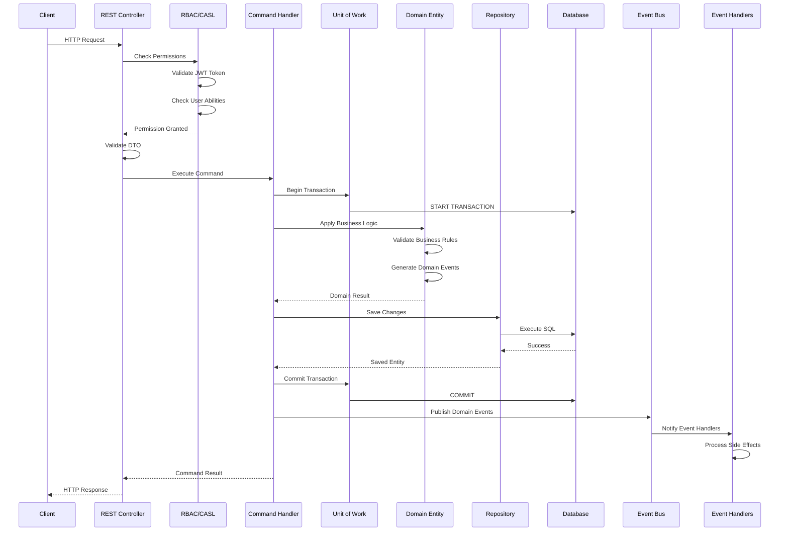

## Domain-Driven Design Integration

### **DDD Core Components Integration**

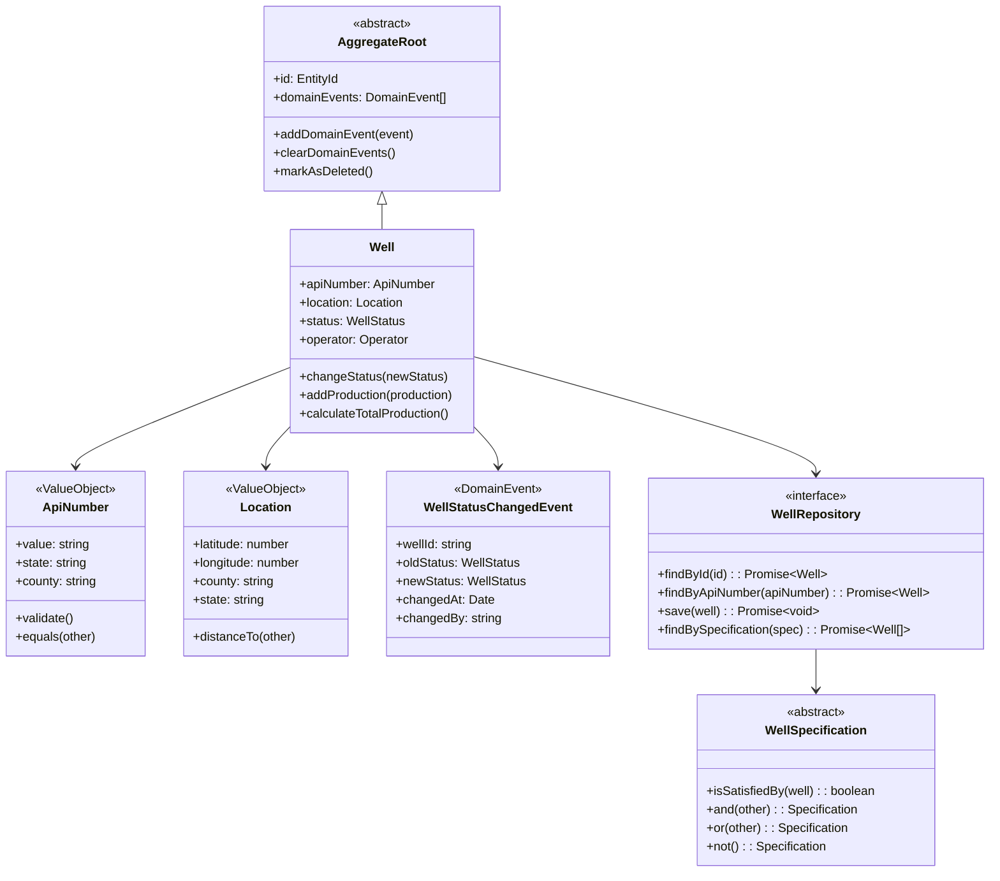

## CQRS Implementation Integration

### **Command and Query Flow**

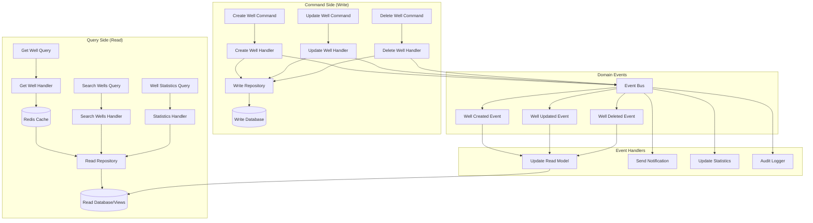

## Repository Pattern Integration

### **Repository Hierarchy and Specifications**

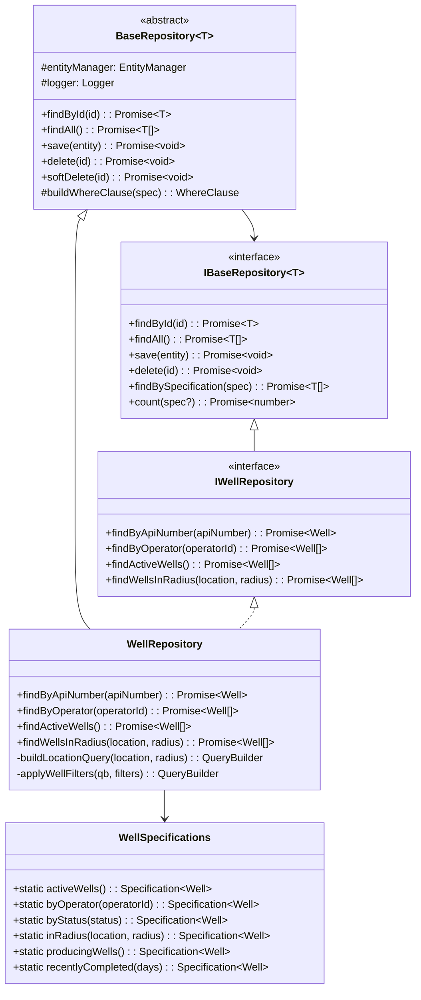

## Unit of Work Pattern Integration

### **Transaction Management Flow**

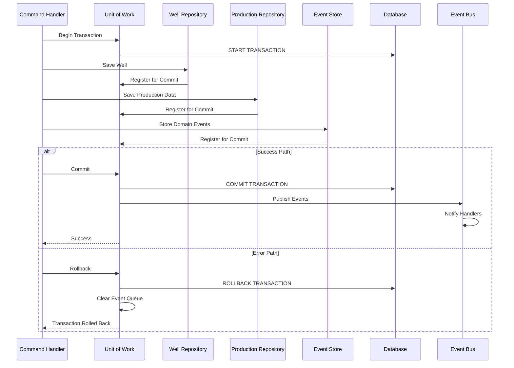

## External System Integration

### **Anti-Corruption Layer and Circuit Breaker**

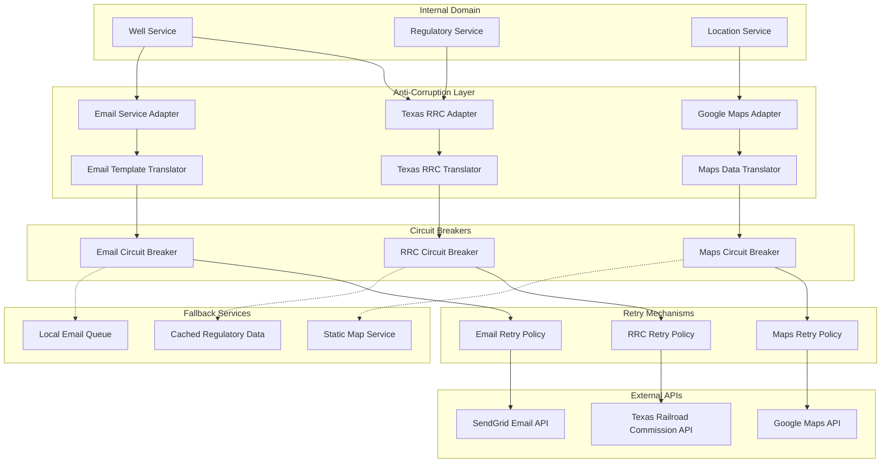

## Security Integration (RBAC with CASL)

### **Permission-Based Access Control Flow**

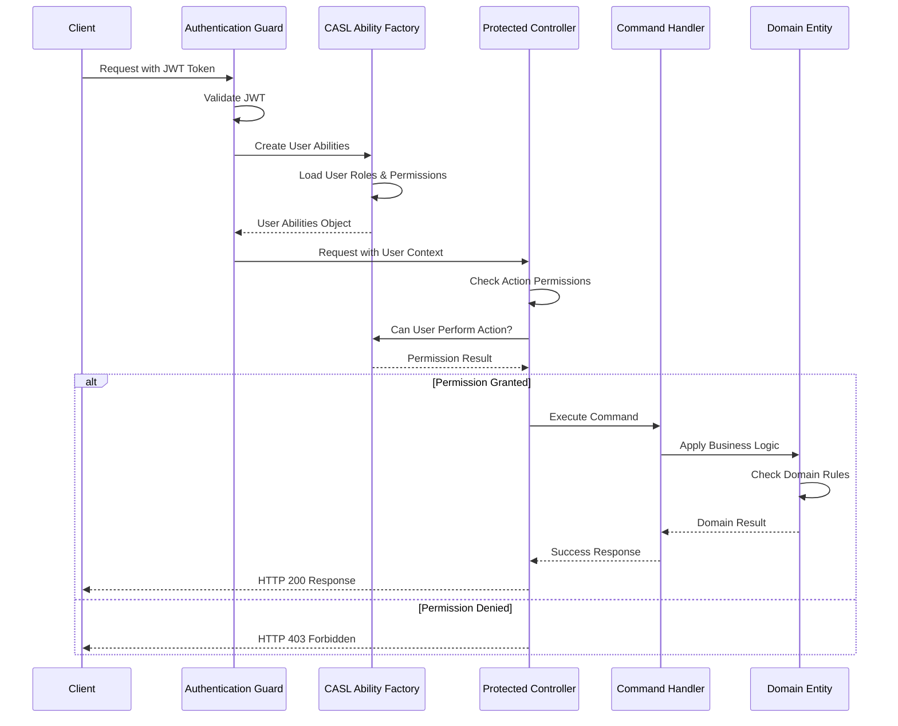

### **Role-Based Permission Matrix**

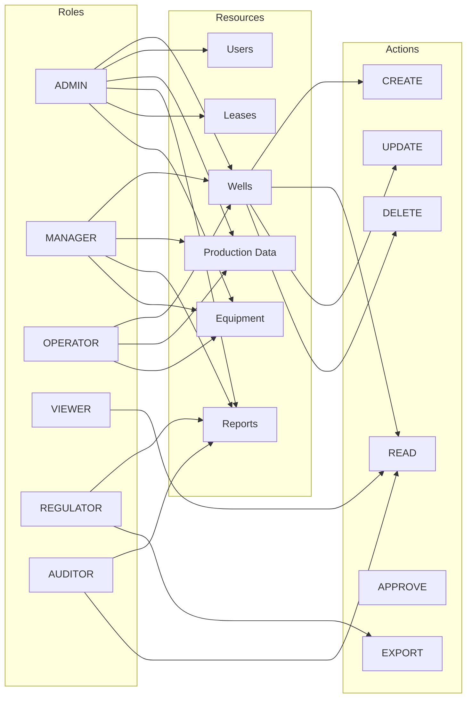

## Event-Driven Architecture Integration

### **Domain Events and Side Effects**

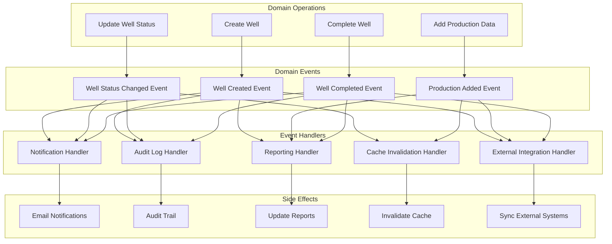

## Strategy Pattern Integration

### **Multi-Tenant and State-Specific Logic**

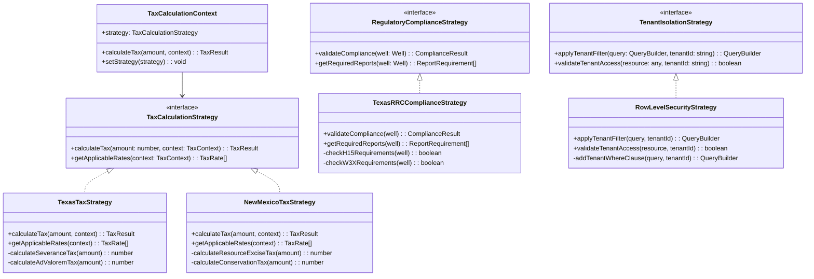

## Factory Pattern Integration

### **Domain Object Creation**

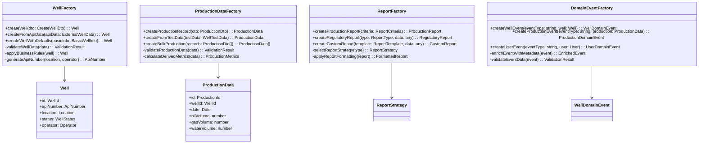

## Resilience Patterns Integration

### **Circuit Breaker and Retry Pattern Coordination**

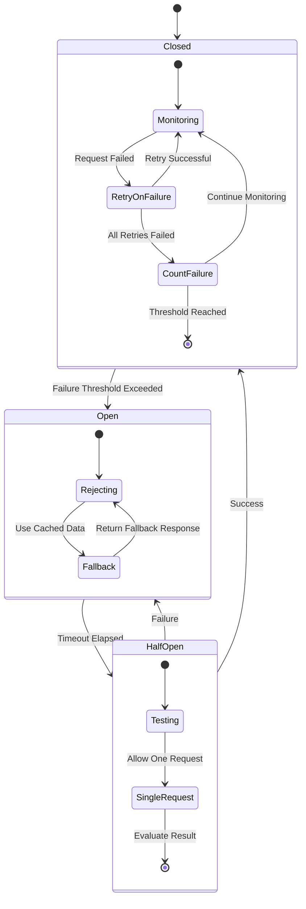

### **Fallback Strategy Integration**

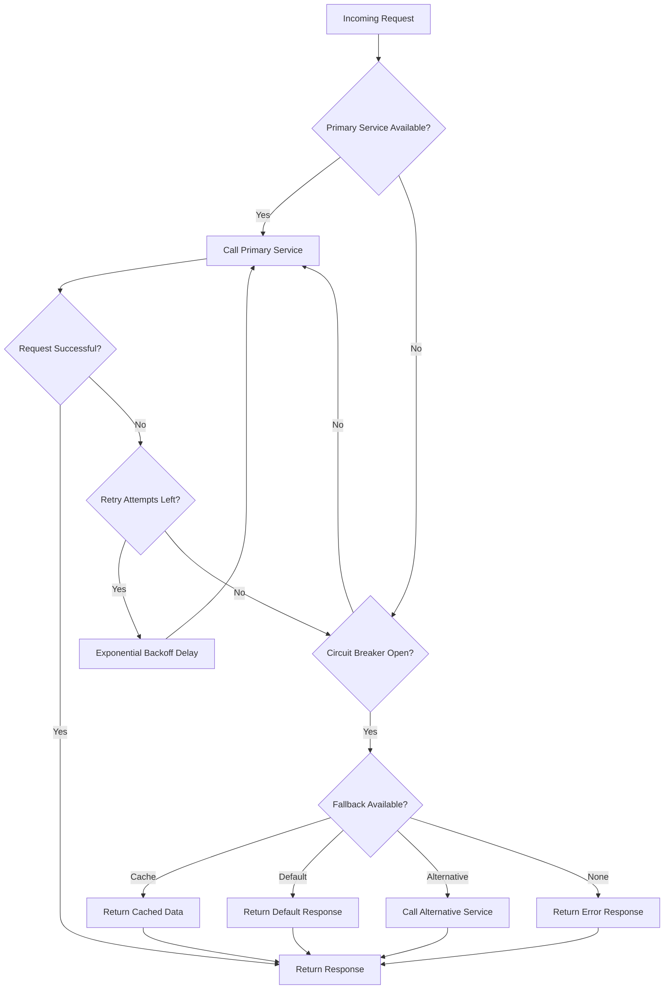

## Performance Optimization Integration

### **Caching Strategy Layers**

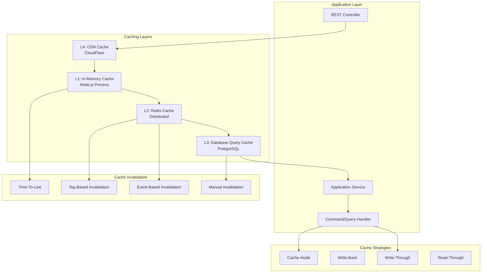

## Database Integration Patterns

### **Multi-Database Strategy**

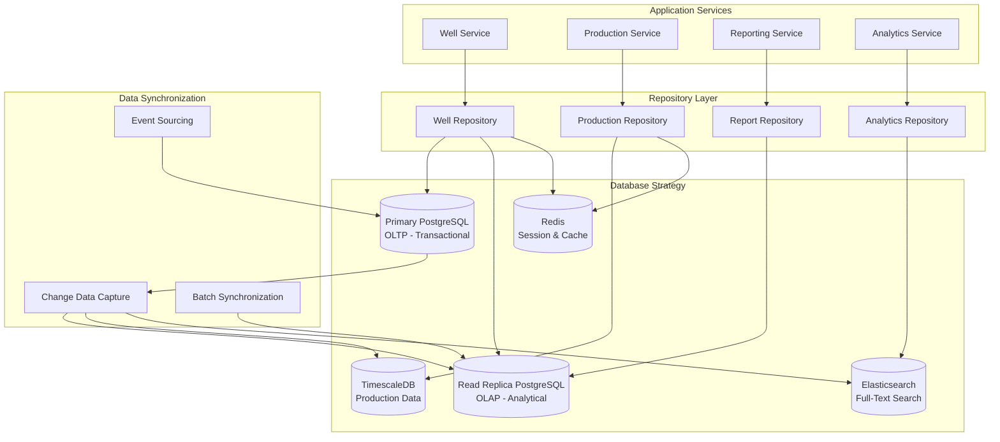

## Monitoring and Observability Integration

### **Comprehensive Monitoring Strategy**

```mermaid
graph TB
    subgraph "Application Metrics"
        BusinessMetrics[Business Metrics<br/>Wells Created, Production Added]
        TechnicalMetrics[Technical Metrics<br/>Response Time, Error Rate]
        SecurityMetrics[Security Metrics<br/>Failed Logins, Permission Denials]
    end

    subgraph "Infrastructure Metrics"
        DatabaseMetrics[Database Metrics<br/>Query Performance, Connections]
        CacheMetrics[Cache Metrics<br/>Hit Rate, Memory Usage]
        ExternalAPIMetrics[External API Metrics<br/>Response Time, Failures]
    end

    subgraph "Logging Strategy"
        StructuredLogs[Structured Logging<br/>JSON Format]
        CorrelationIDs[Correlation IDs<br/>Request Tracing]
        AuditLogs[Audit Logs<br/>User Actions]
    end

    subgraph "Alerting System"
        ErrorAlerts[Error Rate Alerts]
        PerformanceAlerts[Performance Alerts]
        SecurityAlerts[Security Alerts]
        BusinessAlerts[Business Rule Alerts]
    end

    subgraph "Monitoring Tools"
        Prometheus[Prometheus<br/>Metrics Collection]
        Grafana[Grafana<br/>Dashboards]
        ELK[ELK Stack<br/>Log Analysis]
        Sentry[Sentry<br/>Error Tracking]
    end

    %% Metrics Flow
    BusinessMetrics --> Prometheus
    TechnicalMetrics --> Prometheus
    SecurityMetrics --> Prometheus
    DatabaseMetrics --> Prometheus
    CacheMetrics --> Prometheus
    ExternalAPIMetrics --> Prometheus

    %% Logging Flow
    StructuredLogs --> ELK
    CorrelationIDs --> ELK
    AuditLogs --> ELK

    %% Visualization
    Prometheus --> Grafana
    ELK --> Grafana

    %% Error Tracking
    TechnicalMetrics --> Sentry
    SecurityMetrics --> Sentry

    %% Alerting
    Prometheus --> ErrorAlerts
    Prometheus --> PerformanceAlerts
    ELK --> SecurityAlerts
    BusinessMetrics --> BusinessAlerts
```

This comprehensive backend integration architecture ensures that all patterns
work together seamlessly to provide an enterprise-grade, maintainable, and
scalable API solution for the WellFlow oil & gas application. Each pattern has
its specific role while contributing to the overall system's robustness,
security, performance, and observability.
