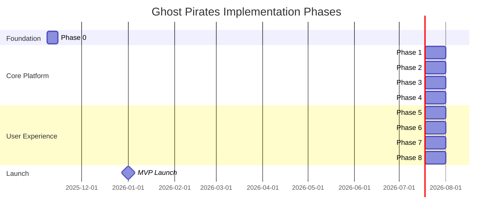

# Project Overview: Ghost Pirates

**Version**: 1.0
**Last Updated**: November 8, 2025
**Target Launch**: January 1, 2026 (MVP)
**Status**: Ready for Implementation

---

## Vision Statement

**Ghost Pirates is the Platform for Ephemeral AI Teams** - a SaaS platform that democratizes complex multi-agent AI orchestration. Users define a project goal via natural language, and the system automatically creates ephemeral, specialized AI teams that collaboratively execute that mission—then dissolve once complete.

### The Metaphor

- **Ghosts**: AI team instances are ephemeral—spawned on-demand, operate in isolation in the cloud, and vanish when missions complete (like digital ghosts)
- **Pirates**: Teams go on focused missions to "secluded islands" (isolated project execution contexts) to retrieve treasure (project outcomes), returning only when successful or failed

---

## The Problem We're Solving

AI agent orchestration is complex and time-consuming:

- **Hours to configure** multi-agent systems manually
- **Limited visibility** into what agents are doing
- **No quality control** - accepting first outputs without review
- **Hidden costs** - token usage spiraling without tracking
- **Brittle failures** - systems break without recovery mechanisms
- **Complexity overhead** - requires AI/ML expertise to deploy

**Annual cost of complexity**: $50K-200K in engineering time + failed implementations

---

## Our Solution

One unified platform that covers **every aspect** of autonomous AI team operations:

- Team creation via natural language goals
- Autonomous hierarchical task decomposition
- Specialized worker agent formation
- Manager-led quality review loops
- Real-time progress dashboards
- Complete audit trails
- Checkpoint-based error recovery
- Transparent cost tracking
- Per-mission pricing

**Pricing**: Per-mission model (vs fixed SaaS subscriptions)

---

## Strategic Goals

### Primary Goals

1. **Prove Core Feasibility**
   - Demonstrate autonomous team creation from goals
   - Show hierarchical task decomposition works
   - Validate quality feedback loops improve outcomes

2. **Build User Confidence**
   - Real-time visibility into team progress
   - Complete audit trail of all decisions
   - Transparent cost tracking

3. **Establish Business Model**
   - Per-mission pricing validation
   - Cost tracking accurate within ±5%
   - Sustainable unit economics

### Secondary Goals

4. **Pattern Recognition**
   - Learn from successful missions
   - Recommend team compositions
   - Improve over time

5. **Best-in-Class Developer Experience**
   - Rust backend for performance
   - Modern Next.js frontend
   - Protocol Buffers type safety
   - Comprehensive testing

---

## Market Opportunity

### Total Addressable Market (TAM)

**Global AI Agents Market**:
- **$7.63 billion** by 2025
- **$50.31 billion** by 2030
- **CAGR**: 45.6% (2025-2030)

**Multi-Agent Systems**:
- 70% of executives consider agentic AI essential
- 38% of startups now solo-founded (up from 22% in 2015)
- Growing demand for AI leverage without hiring teams

### Serviceable Addressable Market (SAM)

**Target Segments**:
- **Solo founders** needing team-scale execution
- **Small businesses** (5-25 people) augmenting capacity
- **AI researchers** prototyping multi-agent systems
- **Enterprise innovation teams** validating AI use cases

**Market Size (Estimate)**:
- 100K+ potential users in Year 1-3
- Average 10 missions/month per active user
- $5-50 per mission average

### Competitive Landscape

| Competitor | Approach | Weaknesses |
|------------|----------|------------|
| **LangGraph** | Framework (code required) | Requires developer expertise, no UI |
| **CrewAI** | Framework (code required) | No hosted solution, manual orchestration |
| **AutoGen** | Framework (Microsoft) | Academic focus, complex setup |
| **ChatGPT Teams** | Flat agents | No hierarchy, limited orchestration |
| **Anthropic Claude** | Single agent | Not multi-agent, manual coordination |
| **Ghost Pirates** | **Fully autonomous platform** | **Natural language → complete execution** |

**Key Differentiators**:
1. **Zero-Code Required**: Natural language goal → working team
2. **True Autonomy**: Manager agents lead workers independently
3. **Quality Loops**: Built-in review and revision system
4. **Full Transparency**: Every decision logged and visible
5. **Mission-Based Pricing**: Pay per outcome, not per seat

---

## Product Strategy

### MVP Scope (Phase 1 - Weeks 1-16)

**Core Features**:
- User authentication and workspace creation
- Team creation wizard (goal → auto-team-formation)
- Manager agent autonomously creates 3-5 specialized workers
- Hierarchical task decomposition (goal → tasks → subtasks)
- Task assignment based on worker specialization
- Worker execution with tool access
- Manager review and revision request system
- Real-time team dashboard
- Audit trail and message history viewer
- Cost tracking and billing
- Error recovery with checkpoint-based resumption

**Agent Capabilities (MVP)**:
- **Manager Agent**: Goal analysis, team formation, work quality review, revision feedback
- **Worker Agents**: Researcher/Analyzer, Content Creator, Technical Executor

**Tool Support (MVP)**:
- Web search (Brave/Google)
- Code execution sandboxes
- File I/O
- Data analysis
- API integration

### What's NOT in MVP (Phase 2+)

- Machine learning model fine-tuning
- Inter-team coordination
- Advanced emergence detection
- Custom agent creation
- Workflow templates
- Advanced analytics and reporting
- Integration marketplace
- Multi-language support

---

## Implementation Timeline

### Phase-Based Delivery



### Key Milestones

| Milestone | Target | Description |
|-----------|--------|-------------|
| **Infrastructure Complete** | Week 1 | Azure + Rust + Next.js running |
| **Database Schema Live** | Week 2 | PostgreSQL + Redis operational |
| **Agents Working** | Week 4 | Manager creates workers, decomposes goals |
| **Tools Executing** | Week 8 | Workers use tools successfully |
| **Dashboard Live** | Week 10 | Real-time updates working |
| **Recovery Functional** | Week 14 | Checkpoints + retry working |
| **MVP Launch** | Week 16 | General availability |

---

## Key Success Metrics

### Technical Metrics (MVP Targets)

| Metric | Target | Measurement |
|--------|--------|-------------|
| API Availability | 99% | Uptime monitoring |
| P50 Latency | <500ms | Request timing |
| P99 Latency | <2s | Request timing |
| Error Rate | <5% | Failed requests |
| Agent Success Rate | >75% | Completed missions |
| Task Revision Rate | <2 avg | Revisions per task |

### Business Metrics

| Metric | Target | Notes |
|--------|--------|-------|
| Team Creation Rate | 10+/week | Indicates adoption |
| Average Team Size | 4-6 agents | Complexity measure |
| Team Success Rate | >85% | First-time completion |
| Cost per Mission | $5-50 range | Pricing validation |
| User Satisfaction | >4.0/5.0 | NPS score |
| Time to Completion | <30 min avg | User experience |

---

## System Architecture Overview

### High-Level Architecture

```
┌─────────────────────────────────────────────────────────────────┐
│                     GHOST PIRATES PLATFORM                       │
├─────────────────────────────────────────────────────────────────┤
│                                                                   │
│  ┌──────────────┐                                                │
│  │   UI Layer   │ (Next.js React)                                │
│  │              │ - Team creation wizard                          │
│  │              │ - Real-time dashboard                           │
│  │              │ - Audit trail viewer                            │
│  └────────┬─────┘                                                │
│           │                                                       │
│           │ (REST API + WebSocket)                               │
│           │                                                       │
│  ┌────────▼──────────────────────────────────────────────────┐   │
│  │         BACKEND (Rust + Axum)                             │   │
│  │                                                            │   │
│  │  ┌──────────────────┐         ┌──────────────────────┐   │   │
│  │  │  Team Manager    │         │  Task Orchestrator   │   │   │
│  │  │  - Formation     │         │  - Decomposition     │   │   │
│  │  │  - Lifecycle     │         │  - Assignment        │   │   │
│  │  │  - Isolation     │         │  - Execution         │   │   │
│  │  └──────────────────┘         └──────────────────────┘   │   │
│  │                                                            │   │
│  │  ┌──────────────────┐         ┌──────────────────────┐   │   │
│  │  │  Agent Runtime   │         │  Communication Mgr   │   │   │
│  │  │  - Manager Agents│         │  - Message Routing   │   │   │
│  │  │  - Worker Agents │         │  - Logging           │   │   │
│  │  │  - Tool Selection│         │  - Audit Trails      │   │   │
│  │  └──────────────────┘         └──────────────────────┘   │   │
│  │                                                            │   │
│  │  ┌──────────────────┐         ┌──────────────────────┐   │   │
│  │  │  Memory System   │         │  Error & Recovery    │   │   │
│  │  │  - KnowledgeBase │         │  - Checkpointing     │   │   │
│  │  │  - Learning      │         │  - Failure Handling  │   │   │
│  │  │  - Context Cache │         │  - Escalation        │   │   │
│  │  └──────────────────┘         └──────────────────────┘   │   │
│  └────────┬──────────────────────────────────────────────────┘   │
│           │                                                       │
│  ┌────────▼──────────────────────────────────────────────────┐   │
│  │       DATA LAYER (PostgreSQL + Redis)                     │   │
│  │                                                            │   │
│  │  - Teams, Members, Tasks, Subtasks                        │   │
│  │  - Agent State & Profiles                                 │   │
│  │  - Message History & Audit Logs                           │   │
│  │  - Checkpoints & Resume States                            │   │
│  │  - Learning Data & Patterns                               │   │
│  └────────┬──────────────────────────────────────────────────┘   │
│           │                                                       │
│  ┌────────▼──────────────────────────────────────────────────┐   │
│  │      EXTERNAL INTEGRATIONS                                │   │
│  │                                                            │   │
│  │  - Claude API (Anthropic)                                 │   │
│  │  - GPT-4 (OpenAI)                                         │   │
│  │  - Web Search APIs                                        │   │
│  │  - Tool Execution Services                                │   │
│  └────────────────────────────────────────────────────────────┘   │
│                                                                   │
└─────────────────────────────────────────────────────────────────┘
```

### Core Architectural Principles

1. **Team Isolation**: Each team operates independently with no cross-team resource contention
2. **Hierarchical Organization**: Manager agent leads specialized workers
3. **Autonomous Execution**: Workers execute independently with manager oversight
4. **Quality Feedback Loops**: Manager reviews work and requests revisions
5. **Full Transparency**: Complete audit trail of all decisions and communications
6. **Graceful Degradation**: System continues operating when components fail

---

## Technology Stack

### Backend
- **Rust 1.75+** (Axum 0.7, SQLx 0.7, Tokio 1.35)
- **PostgreSQL 15+** (ACID, JSONB, pgvector for embeddings)
- **Redis 7+** (Session cache, pub/sub, task queue)

### Frontend
- **Next.js 14** with React 18 (Server-Side Rendering)
- **Tailwind CSS** + Shadcn UI
- **React Query** + Zustand (State management)
- **Recharts** (Analytics visualization)

### AI/ML
- **Claude 3.5 Sonnet** (Primary LLM for managers)
- **GPT-4** (Alternative/fallback)
- **Anthropic SDK** (API integration)

### Infrastructure
- **Azure Kubernetes Service** (Container orchestration)
- **Azure Database for PostgreSQL Flexible Server**
- **Azure Managed Redis**
- **Azure Static Web Apps** (Next.js hosting)
- **GitHub Actions** (CI/CD)
- **Terraform** (Infrastructure as Code)

---

## Risks & Mitigation

### High-Risk Items

#### Risk 1: LLM API Rate Limits
**Probability**: High | **Impact**: Medium
**Mitigation**:
- Implement smart queuing with exponential backoff
- Fallback to alternative models (Claude ↔ GPT-4)
- Real-time rate limit monitoring

#### Risk 2: Complex Task Failures
**Probability**: High | **Impact**: High
**Mitigation**:
- Robust checkpoint-based recovery
- Automatic retry with progressive fallbacks
- Human escalation paths

#### Risk 3: Token Cost Overruns
**Probability**: Medium | **Impact**: Medium
**Mitigation**:
- Real-time cost tracking with alerts
- Budget enforcement per team
- Intelligent caching of responses

#### Risk 4: Agent Quality Variance
**Probability**: Medium | **Impact**: Medium
**Mitigation**:
- Manager review loops catch low-quality work
- Revision feedback improves over iterations
- Learning from successful patterns

---

## Success Criteria

Ghost Pirates MVP is considered **production-ready** when:

- ✅ Users can create AI teams via simple goal descriptions
- ✅ Teams autonomously form with 3-5 specialized workers + manager
- ✅ Teams complete missions with success rate >75% on first attempt
- ✅ Revision feedback loop reduces iterations to <2 on average
- ✅ Dashboard provides real-time visibility into team progress
- ✅ System handles graceful failure recovery for >85% of edge cases
- ✅ Cost tracking accurate within ±5%
- ✅ 99% API availability achieved
- ✅ <2s P99 latency for all endpoints
- ✅ Complete audit trail for all team actions

---

## Next Steps

1. **Review this document** with all stakeholders
2. **Proceed to [01-technology-stack.md](./01-technology-stack.md)** for complete tech decisions
3. **Start implementation** with [02-infrastructure-setup.md](./02-infrastructure-setup.md)
4. **Track progress** using checkboxes in each phase document
5. **Monitor KPIs** per [18-success-metrics.md](./18-success-metrics.md)

---

**Ghost Pirates: Deploy AI teams. Complete missions. Dissolve when done. 🏴‍☠️👻**

_Let's democratize multi-agent AI orchestration._
